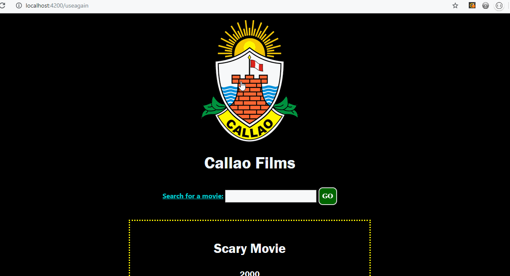

# Movie App Name

Author: Luis Carazas

This application allows the user to search for a movie

## Time spent
Describe the time you spent on the project.
 * Tutorials, research: 4 hours
 * Coding required stories: 12 hours
 * Optional and extras: 2 hours

## User stories
It was a challenging project. A lot of JavaScript ideas that I need to learn. I spent a lot of my time
looking at the data-example that Professor put up. I am still not very clear on how everything is moving around on the
application, but I get an idea. I've worked with API's for two small tasks for another class before but nothing like this.
I still have to figure out how to display more details on a specific movie but I feel I am close.

### Required
 * [x] User can search for movies. 
 * [x] On page load, user can see 3-5 pre-selected movies.
 * [ ] User can click on movie to see a detail page with more information (e.g. ratings, descriptions, author)

### Optional

 * [x] Fade in the poster images
 * [ ] Have a toggle which switches the search layout between a "grid" view and a "table" style view
 * [ ] Have an error message if the API fails to load.
 * [ ] Show a loading state when fetching for a movie
 * [ ] Have a pagination mechanism that allows the user to see more results. Show the total number of results.
 * [ ] Add a light/dark color theme toggle on the page
 * [x] Page is optimized for the viewport/browser size (i.e. scales to mobile & desktop sizes)

### Extra

 * I added a "Back to Top" button at the bottom of the page, in case the user scrolled all the way down.

## GIF Walkthrough

GIF created with [LiceCap](https://www.cockos.com/licecap/).

## Notes & shoutouts

Thank you, Professor for being available all the times I needed it and guiding me in the necessary
steps. I tried to YouTube a lot of the things but it all just felt more unclear. The Ember.js guides were
okay to look at but then a bit challenging to implement.